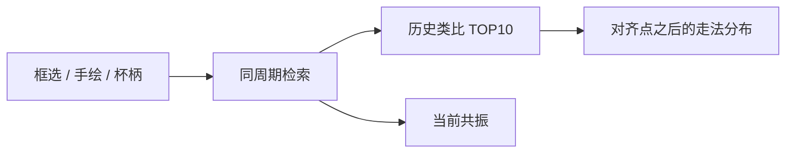

# WAVE

K 线波形匹配终端：框选一段走势，从历史里找出相似波形，并给出相似度与对齐之后的走法分布。

浏览器里是工作台，不是落地页。行情走 Binance / OKX / Gate 的公开 REST，**不需要 API Key**。

## 能做什么

- **框选匹配**：在主图上圈一段已收盘 K 线（桌面按住 Shift 拖选；手机拖黄色区间），同周期检索历史相似段。
- **历史类比 + 当前共振**：历史池里找不重叠的 TOP10；同时看其它标的「同一时刻」走得像不像。
- **对齐后走法**：类比图带「当时此刻」标记，给出随后 N 根的中位路径、四分位和收涨比例。
- **多通道加权**：收盘走势（MASS / Pearson）为主，K 线结构（影线 / 实体）和成交量可加权。顶栏有「推荐 / 仅收盘 / 形态优先 / 量价 / 自定义」，权重填 0 则跳过该通道。
- **赛道门控**（框选）：山寨历史只对自身 + BTC + ETH；黄金只对黄金；美股只对美股。手绘和杯柄全市场扫描不套这层门。
- **手绘查询**：画出一条波形，按所选周期在全池里搜当前 K 线；波形可命名保存，下次一键再搜。
- **杯柄一键**：扫谁停在柄上（现价，含币安成交额靠前的币）、历史上谁走过。
- **按需搜标的**：搜索框模糊匹配交易所里的币 / 股票 / 大宗，点选后拉滚动窗口进共享缓存（周期有效期内复用）。

默认周期 **1D**。周期只在 `1H` / `4H` / `12H` / `1D` 内检索，**从不混周期**。

## 匹配怎么算

查询窗口做成价格无关的形状：收盘路径窗口内 z-score，再用 MASS（FFT）算 Pearson `r`，分数为 `max(0, r) × 100`。

结构通道把上影、下影、实体、方向实体做同样的窗口 z-score 再 Pearson；量通道对 `log1p(volume)` 做 MASS。量对不上会降权，不会整段刷掉。只匹配已收盘 K 线。

框选时的历史检索按赛道收缩宇宙；手绘 / 杯柄仍全池。同资产窗口重叠超过 50% 时做 NMS，只留更高分。

主序列池默认在 `config/universe.yaml`：加密用 Binance USDT 现货，黄金用 OKX `XAUT-USDT`，美股代币用 Gate xStocks。可按需加币，搜索框也能拉默认池之外的标的。

## 快速开始

需要 Python 3.11 与 Node 20。安装入口在 `pyproject.toml` 与根目录 `package.json`。

1. 创建虚拟环境并做 editable 安装（带 dev extra）。
2. 构建 `web` 前端。
3. 运行 `kline_match ingest` 拉主序列池。
4. 运行 `kline_match serve`，默认 `127.0.0.1:18765`，浏览器打开该地址。
5. 日常开发用根目录的 `dev` 脚本（API 与 Vite 分开，`/api` 会代理）。
6. 容器用根目录 Dockerfile / compose；数据在 named volume。增量用 `sync.sh`。

币安若主站返回 451，会自动改走 `data-api.binance.vision`。拉行情失败会报错，不会编造 OHLC。

CLI 子命令：`ingest`、`sync`、`match`、`status`、`serve`。例如 `kline_match match BTC 1D --n 30`。

## HTTP API

| 方法 | 路径 | 说明 |
| --- | --- | --- |
| GET | /api/health | 存活 |
| GET | /api/status | 各序列入库进度 |
| GET | /api/universe?tf=1D | 宇宙与默认窗口长度 |
| GET | /api/klines?asset=BTC&tf=1D | K 线；pad_after 为对齐点之后的根数 |
| GET | /api/search?q= | 模糊搜交易所标的 |
| POST | /api/symbols/ensure | 按需拉滚动窗口进共享缓存 |
| GET | /api/match/presets | 权重预设 |
| POST | /api/match | 框选 / 手绘 / 杯柄匹配 |
| GET / POST | /api/templates | 手绘模板 |
| GET | /api/patterns | 形态快捷（杯柄等） |

框选匹配 body 示例：asset 为 BTC，tf 为 1D，n 为 30，并带 start_ts / end_ts 与 preset=recommend。

手绘传 path（归一化 y 序列）；杯柄传 pattern=cup_handle。

## 架构

FastAPI + SQLite（WAL）+ Vite / React + lightweight-charts。匹配在本地主序列池上做，前端是静态资源，由同一进程托管。

这是常驻服务，需要磁盘。无服务器函数不适合入库和 SQLite。自托管用 Docker，挂一块持久盘即可。若把端口打到公网，请自己加反向代理和访问控制；默认没有登录。

仓库根目录的 Docker 与 compose 可一键拉起。首次启动会写入本地数据库，之后按小时增量追新即可。

## 测试

仓库 tests 目录下有匹配、赛道、搜索、形态等用例。

## 免责声明

WAVE 是形态检索工具，不是投资建议。历史相似不构成对未来的预测。使用风险自负。

## License

MIT，见 LICENSE 文件。
